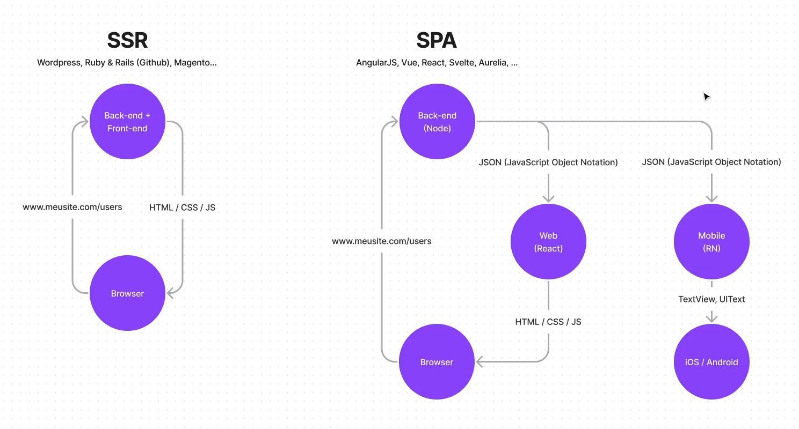

<h1 align="center">
Watcho_habits-tracker-app 📱


# End-to-end SPA application that has been developed for mobile & web services linked from a database using prism.

<h2 align="center">
What's a <strong>SPA</strong> application?



### _'Single Page Application'_ - Where basically when it does a browser route the backend does a listing that now doesn't have an HTML/CSS/JS statement no longer being responsible for building the site completely, but rather passing it through **_JSON (JavaScript Object Notation)_**.

---

# What's the Watcho habit tracker app?

<p> Complete application, where you control your routine and your habits. </P>

---

# Environment Variables

To run this project, you will need to add the following environment variables to your .env file:

`DATABASE_URL="file:./dev.db"`

## Run Locally

Clone the project

```bash
  git clone https://github.com/jonrusso/Watcho_habit-tracker_app.git
```

Go to the project directory

```bash
  cd habits
```

Install the dependencies of each application

```bash
  cd server
  npm install
```

```bash
  cd web
  npm install
```

```bash
  cd mobile
  npm install
```

Start the server and web application using:

```bash
  npm run dev
```

Start the mobile application using:

```bash
  npx expo start
```

## Authors

- [@diego3g](https://github.com/diego3g)
- [@rodrigorgtic](https://github.com/rodrigorgtic)
- [@jonrusso](https://www.github.com/jonrusso)
